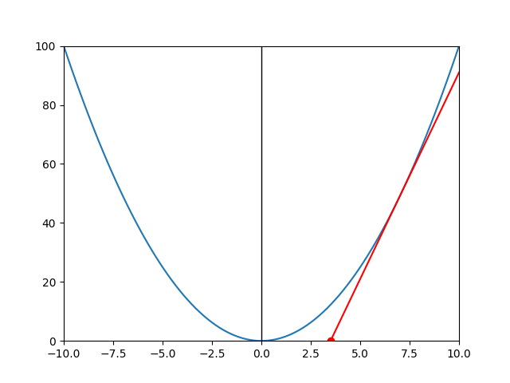

# Implementation

### Square Roots

`pig_sqrt(double value)` and `pig_sqrt_i(double value, uint8_t iterations)`

The square root functions in PigMath are implemented using Newton's method. In order to fully understand this, some basic calculus is required.

Newton's method is a fairly quick way to compute the roots of *any* function, and provides a very simple way to implement square root functions. An initial guess x1 is required, which is currently defined as half of the given value. The next guess x2 is computed by subtracting the function over its derivative from x1. In general, xn+1 = xn - f(x)/f'(x). This process is repeated over a number of iterations (can be specified by user in `pig_sqrt_i()`).

This process essentially finds the root of the tangent line of x2 at its current iteration. One of these computations can be visualized:

The full implementation of the functions can be found in the [PigMath header file](../include/pigmath.h)

### Floors and Ceilings

`pig_floor(double value)` and `pig_ceil(double value)`

The floor and ceiling values in PigMath are implemented simply by casting `value` and `value + 1` to `int` and losing all floating point information:

    int pig_floor(double value) {
        return (int)value;
    }

    int pig_ceil(double value) {
        return (int)(value + 1);
    }

To some purists, this loss of information is something to be avoided, but floor and ceiling functions lose information by definition.
